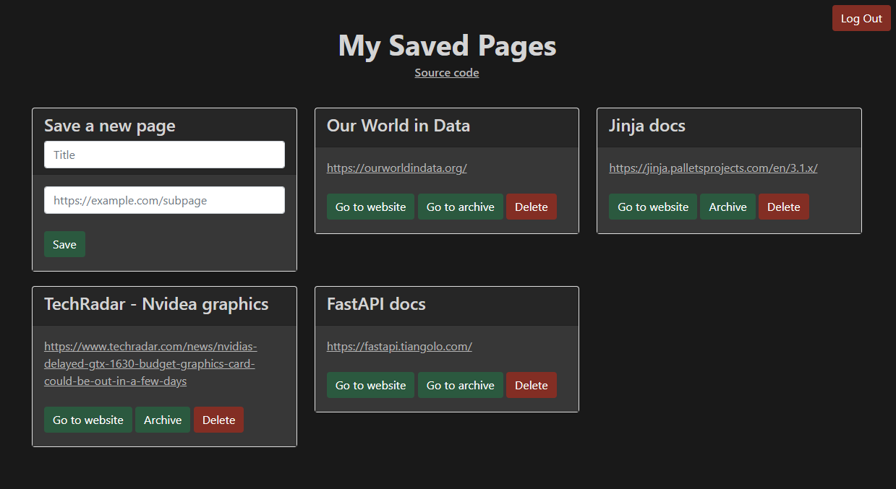

# Webpage Archive Webapp + API

<table>
<tr>
<td>
A CRUD webapp that allows users to log in and save webpage urls. It also allow for archiving pages on the <a href="https://archive.org/web/">WayBackMachine</a> so that the content is available even if the orginal page is taken down.
</tr>
</td>
</table>

## [Live Demo](https://webpagearchive.deta.dev/)
Checkout a live demo of the webapp [here](https://webpagearchive.deta.dev/).

## How it works
* User signs up or logs in with chosen username and password. Password is hashed using <a href="https://en.wikipedia.org/wiki/Bcrypt">bycrypt</a> and stored in a <a href= "https://docs.deta.sh/docs/base/about">Deta noSQL database</a>. A temporary access token is also generated, using <a href="https://jwt.io/">JWT</a> each time the user logs in/signs up and it is saved as a browser cookie (valid for 4h or until user logs out).
* A new page is saved by filling up the form request on "Save a new page". By clicking save a POST request is sent to the API built with <a href="https://fastapi.tiangolo.com/">FastAPI</a>. The API then validates if the url format is valid and inserts the new webpage on the database.
* By pressing "Archive" in a saved webpage a call is made to the <a href="https://archive.org/web/">WayBackMachine</a> to archive the url. If successful the "Archive" button will display "Go to archive" and the database record will be updated with the archive url.

## Installation
Clone the repo:
```bash
$ git clone https://github.com/tngaspar/webpage-archive-api.git
```
Install dependencies. I advice the use of a [virtual environment](https://docs.python.org/3/library/venv.html) for isolation.
```bash
$ pip install -r requirements.txt
```
Create a <a href="https://www.deta.sh/">Deta<a> account and install deta Space CLI.

Add a `config.py` file in the project root directory with:

```python
# config.py
deta_private_key = '********************************************'
db_user_secret_key = '********************************************'
```
Get  `deta_private_key` by creating a collection on Deta Space and choose a `db_user_secret_key` (used to generate access tokens).

The app can now be initiated:

### - Locally with uvicorn:
```bash
$ uvicorn main:app --reload
```
and accessed at `http://localhost:8000/`

### - On Deta (public):
```bash
$ deta new
$ deta push
```

## Requirements

* <a href="https://fastapi.tiangolo.com/">FastAPI</a>
* <a href="https://github.com/pyca/bcrypt/">Bcrypt</a>
* <a href="https://github.com/jpadilla/pyjwt">PyJWT</a>
* <a href="https://www.uvicorn.org/">Uvicorn</a>
* <a href="https://palletsprojects.com/p/jinja/">Jinja2</a>
* <a href="https://github.com/encode/starlette">Starlette</a>
* <a href="https://docs.deta.sh/docs/home/">Deta</a>
* <a href="https://pypi.org/project/regex/">Regex</a>
* <a href="https://akamhy.github.io/waybackpy/">WayBackPy</a>
* <a href="https://github.com/andrew-d/python-multipart">Python-multipart</a>
* <a href="https://pydantic-docs.helpmanual.io/">Pydantic</a>

<p align="right">(<a href="#top">back to top</a>)</p>

